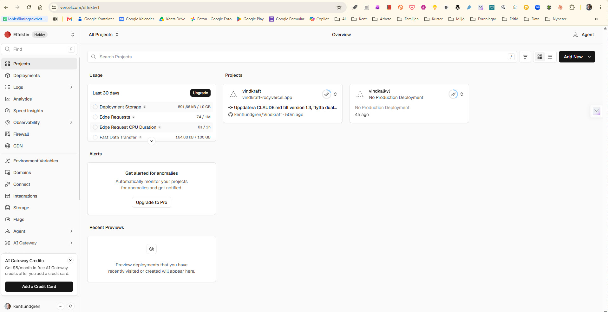

# Vindkraftskalkyl – Vercel-version

Denna mapp innehåller den version av vindkraftskalkylen som deployas via **Vercel**.

Den äldre (fortfarande levande) versionen finns i [`../vindkraftskalkyl/`](../vindkraftskalkyl/) och körs via **GitHub Pages**:
https://kentlundgren.github.io/Vindkraft/vindkraftskalkyl/vindkraftskalkyl.html

## 🗂️ Lokalt repo

Repo-rot lokalt:

`C:\Users\kentl\OneDrive\AI\Cursor\Intressen\Vindkraft`

Den här mappen lokalt:

`C:\Users\kentl\OneDrive\AI\Cursor\Intressen\Vindkraft\vindkraftskalkyl_Vercel`

På GitHub: <https://github.com/kentlundgren/Vindkraft/tree/main/vindkraftskalkyl_Vercel>

---

## Live-URL:er (två olika adresser till samma kalkyl)

| Plattform       | URL                                                                 | Kommentar |
|-----------------|---------------------------------------------------------------------|-----------|
| **Vercel**      | https://vindkraft-rosy.vercel.app                                   | Fungerar (2026-09-14). |
| **GitHub Pages**| https://kentlundgren.github.io/Vindkraft/vindkraftskalkyl/vindkraftskalkyl.html | Ursprunglig live-sida. |

Det är **två olika URL:er** som leder till **samma kalkyl** (samma HTML, CSS och JavaScript).

---

## Team och projekt på Vercel

**Ett team är inte en app.** Ett team är ett *konto/utrymme* på Vercel – ungefär en katalog – där flera **projekt** (appar) kan ligga. Ett nytt kalkylprogram ska alltså bli ett **nytt projekt i samma team**, inte ett nytt team.

| Begrepp | Vad det är | Analogi | Vad du gör |
|---------|------------|---------|------------|
| **Team** | Ett konto/utrymme med gemensam faktura, medlemmar och projektlista. Även ett Hobby-konto kallas *Hobby team*. | En katalog, eller en GitHub-organisation | Byt team uppe till vänster i dashboarden. Skapa inte ett nytt team för varje app. |
| **Projekt** | En app kopplad till ett Git-repo (eller en mapp i ett repo). Har egen URL, egna deployments och egna inställningar. | En app / ett GitHub-repo (eller en Root Directory i ett repo) | Skapa ett **nytt projekt** när en ny modell ska deployas. |
| **Deployment** | En enskild utgåva av projektet (production eller preview). | En publicerad version av appen | Skapas automatiskt vid `git push`. |

Vercel beskriver team som ytan där man samlar projekt och resurser ([Vercel, 2026a](https://vercel.com/docs/accounts)), och projekt som appen som deployas från ett Git-repo ([Vercel, 2026b](https://vercel.com/docs/projects/overview)). Ett repo kan ge flera projekt om olika mappar har olika Root Directory.

### Ditt team: Effektiv (`effektiv1`)

Ja – **`effektiv1` är ditt Vercel-team.** Visningsnamnet i dashboarden är **Effektiv**. Sluggen (adressen) är `effektiv1`. Du ser det uppe till vänster i teamväljaren och i URL:en [https://vercel.com/effektiv1](https://vercel.com/effektiv1). Planen är **Hobby**. Inloggad användare är `kentlundgren`.

Så ser teamet ut (skärmdump 2026-09-14):



Samma bild på GitHub: [Team_effektiv1_i_Vercel.jpg](https://github.com/kentlundgren/Vindkraft/blob/main/vindkraftskalkyl_Vercel/Bilder/Team_effektiv1_i_Vercel.jpg)

På bilden syns bland annat:

- **Effektiv** och **Hobby** uppe till vänster – det är teamet, inte en enskild app.
- **Projects** med två kort: **vindkraft** (har production-URL `vindkraft-rosy.vercel.app`) och **vindkalkyl** (annat projekt i samma team, ännu utan production-deploy).
- Knappen **Add New** uppe till höger – där lägger du till *nästa* projekt i samma team.

| | |
|---|---|
| **Team-namn** | Effektiv |
| **Team-slug** | `effektiv1` |
| **Dashboard** | https://vercel.com/effektiv1 |
| **Team-ID** | `team_I90mljXDP0cWBiwmXIU1he27` |
| **Plan** | Hobby |

Projekt i samma team just nu:

| Projekt | GitHub-repo | Kommentar |
|---------|-------------|-----------|
| **vindkraft** | [kentlundgren/Vindkraft](https://github.com/kentlundgren/Vindkraft) | Denna kalkyl. Root Directory = `vindkraftskalkyl_Vercel`. Live: https://vindkraft-rosy.vercel.app |
| **vindkalkyl** | [kentlundgren/Codex](https://github.com/kentlundgren/Codex) | Annan app i **samma** team – ett exempel på att teamet rymmer flera projekt. |

### Kan samma team användas till många GitHub-projekt?

**Ja – det är poängen.** Teamet Effektiv är tänkt som *ett* utrymme för många appar. Du skapar inte ett nytt team per GitHub-repo. Du skapar ett **nytt Vercel-projekt** i `effektiv1` och kopplar det till det nya GitHub-repot (eller till en mapp i ett befintligt repo).

På Hobby-planen går det att ha upp till **200 projekt** i teamet ([Vercel, 2026c](https://vercel.com/docs/plans/hobby)). Det räcker långt för personliga kalkyler och webbappar. Hobby kräver att GitHub-repot ligger under ett **personligt GitHub-konto** (här: `kentlundgren/...`), inte under en GitHub-organisation ([Vercel, 2026d](https://vercel.com/docs/limits)). Kents vanliga repon passar alltså här.

Skapa ett *nytt* Vercel-team bara om du behöver separat faktura, ett annat GitHub-konto eller samarbete med andra (Pro).

### Koppla ett nytt Git/GitHub-projekt till teamet i framtiden

Gör så här när en ny modell eller app ska få en Vercel-app:

1. **Ha koden i Git och på GitHub** under `kentlundgren/...`. Committa och pusha som vanligt från Cursor.
2. Öppna teamets dashboard: [https://vercel.com/effektiv1](https://vercel.com/effektiv1). Kontrollera att **Effektiv** är valt uppe till vänster – annars hamnar projektet i fel team.
3. Klicka **Add New** → **Project** (samma knapp som på skärmdumpen).
4. **Importa** GitHub-repot. GitHub-kontot `kentlundgren` ska redan vara kopplat till Vercel.
5. Om appen **inte** ligger i repo-roten: sätt **Root Directory** till rätt mapp (så som `vindkraftskalkyl_Vercel` är satt för det här projektet). Lämna tomt om hela repot *är* appen.
6. Klicka **Deploy**. Vercel skapar projektet i teamet Effektiv och bygger en första version ([Vercel, 2026e](https://vercel.com/docs/getting-started-with-vercel/import)).
7. Därefter: redigera i Cursor → Kent committar och pushar själv → Vercel deployar automatiskt till det projektet.

Du behöver alltså **inte** skapa ett nytt team. Du återanvänder `effektiv1` och lägger till ett projekt.

---

## Status – vad som redan är gjort (2026-09-14)

- Mappen `vindkraftskalkyl_Vercel/` skapad.
- De tre filerna (`index.html`, `stil.css`, `berakningar.js`) på plats.
- Vercel-**projektet** **vindkraft** ligger i **teamet** Effektiv (`effektiv1`) och är kopplat till det här GitHub-repot med Root Directory = denna mapp.
- https://vindkraft-rosy.vercel.app fungerar.
- README och CLAUDE.md uppdaterade med dual-publiceringsmönstret.
- Skill `vercel-github-pages-dual-publicering` skapat för att dokumentera mönstret globalt.
- GitHub-länken nere till vänster pekar på denna mapp, och Teknik-modalen nämner både programversion (GitHub Pages) och appversion (Vercel).

---

## Upplever användaren någon skillnad?

**Nej – som vanlig användare/läsare ska man i princip inte märka någon skillnad.**

När du öppnar antingen Vercel-URL:en eller GitHub Pages-URL:en ser du **exakt samma kalkyl**. Det är medvetet.

### Varför ser view-source likadan ut – och hur hittar appen CSS och JavaScript?

HTML-källan ser likadan ut eftersom det *är* samma fil (bara serverad från olika ställen).

Appen får reda på stil och funktionalitet genom **relativa länkar**:

```html
<link rel="stylesheet" href="stil.css">
...
<script src="berakningar.js"></script>
```

Webbläsaren hämtar filerna från samma mapp. Det spelar ingen roll om sidan ligger på GitHub Pages eller Vercel.

---

## Vad skiljer sig då – och varför har man Vercel?

Skillnaden ligger **bakom kulisserna**:

| Aspekt                    | GitHub Pages                              | Vercel                                      |
|---------------------------|-------------------------------------------|---------------------------------------------|
| **Vad användaren ser**    | Samma kalkyl                              | Samma kalkyl                                |
| **Hosting**               | Enkel statisk hosting från GitHub         | Professionell plattform med globalt CDN     |
| **Deploy**                | Manuell / via GitHub Actions              | Automatisk vid varje `git push`             |
| **Preview**               | Begränsat                                 | Varje branch får egen preview-URL           |
| **Prestanda & tillförlitlighet** | Bra för enkla sidor                  | Oftast snabbare och mer robust              |
| **Framtidssäkring**       | Begränsat (mest statiskt)                 | Lätt att lägga till mer (API, auth, analytics, AI-funktioner m.m.) |
| **Arbetssätt**            | Bra för enkla publiceringar               | Bättre när man vill bygga vidare på appen   |

**Cursor gör skillnaden praktisk.** Du redigerar, commit:ar och push:ar från Cursor – Vercel deployar automatiskt. Du behöver inte lämna editorn.

Poängen med Vercel är **inte** att kalkylen ska se annorlunda ut. Poängen är en modern, automatiserad deploy-pipeline medan användaren fortfarande bara upplever "en vanlig bra webbapp".

---

## Alternativ till Vercel – och vad "build" betyder

Du kan skapa en liknande app på flera sätt. Vercel är ett av alternativen.

### Utan build (nuvarande lösning)
Vanlig HTML + CSS + vanilla JavaScript. Fungerar direkt. Inget kompileringssteg. Enkelt att förstå och debugga. Det är det vi använder här.

### Med build (Vite, React, Vue, Svelte m.fl.)
**Build** = att ta modern källkod (komponenter, JSX, TypeScript, import/export) och **omvandla** den till vanliga filer som webbläsaren förstår (HTML, CSS, minifierad JS).

Typiskt flöde med Vite + React:
1. Du skriver komponenter i JSX/TypeScript.
2. Du kör `npm run build` (eller motsvarande).
3. Vite skapar en `dist/`-mapp med optimerade filer.
4. Du publicerar `dist/` till GitHub Pages, Netlify, Cloudflare Pages **eller** Vercel.

**Poängen med build:**
- Bättre struktur för stora appar (komponenter, routing, state).
- Modern utvecklarupplevelse (hot reload, typsäkerhet).
- Optimerad kod till användaren (minifiering, tree-shaking, code-splitting).
- Kräver mer verktyg och ett extra steg – ofta överkill för enkla kalkyler som denna.

**Andra publiceringsalternativ:**
- **Netlify** – liknande Vercel, bra för statiska och JAMstack-appar.
- **Cloudflare Pages** – snabb CDN, generös gratisnivå.
- **GitHub Pages** – enklast för rena statiska sidor (som den ursprungliga kalkylen).
- **Vite + valfri host** – du bygger själv och laddar upp resultatet.

Vercel utmärker sig med extremt enkel Git-integration och preview-deployments per branch.

---

## Skillnad mellan "program" och "app"

| Begrepp     | Betydelse |
|-------------|-----------|
| **Program** | Generellt begrepp för kod med funktionalitet och logik. |
| **App**     | Användarorienterad, interaktiv produkt – särskilt webbappar. |

Vindkraftskalkylen är både ett program och en webbapp.

---

## Filstruktur

```
vindkraftskalkyl_Vercel/
├── README.md          ← den här filen
├── index.html         ← startsidan
├── stil.css
├── berakningar.js
└── Bilder/
    └── Team_effektiv1_i_Vercel.jpg
```

Ingen build behövs. Vercel serverar filerna direkt.

---

## GitHub-länk och Teknik-modal

Gjort (2026-09-14). GitHub-länken nere till vänster pekar på:
https://github.com/kentlundgren/Vindkraft/tree/main/vindkraftskalkyl_Vercel

Teknik-modalen nämner att det finns både en programversion (GitHub Pages) och en appversion (Vercel), och förklarar kort fördelen med den automatiska deployen.

---

## Framåtblick

Nya modeller i detta repo bör följa samma dual-mönster. Mönstret är dokumenterat i:
- denna README
- `CLAUDE.md`
- skill:et `.cursor/skills/vercel-github-pages-dual-publicering/`

---

## Källor

Vercel (2026a) *Account Management.* Tillgänglig: https://vercel.com/docs/accounts (hämtad 14 september 2026). *(Vercels översikt över konton och team: ett team är utrymmet där projekt och resurser samlas, även på Hobby-planen.)*

Vercel (2026b) *Projects overview.* Tillgänglig: https://vercel.com/docs/projects/overview (hämtad 14 september 2026). *(Definierar projekt som en app kopplad till ett Git-repo, med flera deployments under samma projekt.)*

Vercel (2026c) *Hobby Plan.* Tillgänglig: https://vercel.com/docs/plans/hobby (hämtad 14 september 2026). *(Hobby tillåter upp till 200 projekt i ett team.)*

Vercel (2026d) *Limits.* Tillgänglig: https://vercel.com/docs/limits (hämtad 14 september 2026). *(Hobby kan kopplas till Git-repon under ett personligt konto, inte under en GitHub-organisation.)*

Vercel (2026e) *Getting started with Vercel.* Tillgänglig: https://vercel.com/docs/getting-started-with-vercel/import (hämtad 14 september 2026). *(Hur ett GitHub-repo importeras som nytt Vercel-projekt från dashboarden.)*

---

*Uppdaterad 2026-09-14 – teamet effektiv1 visat med skärmdump, och steg för att koppla nya GitHub-projekt till samma team.*
