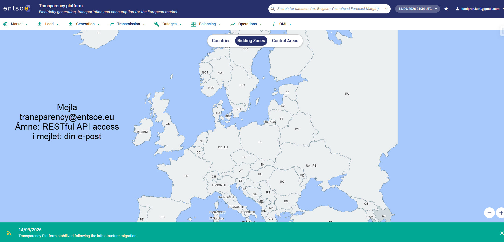
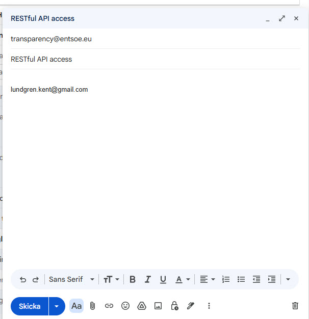
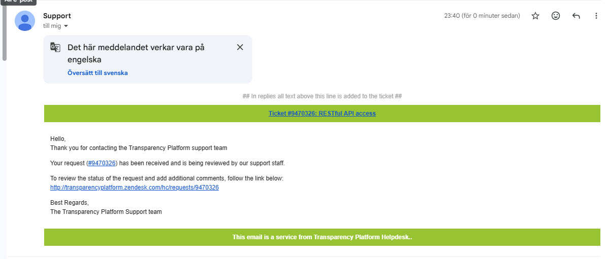
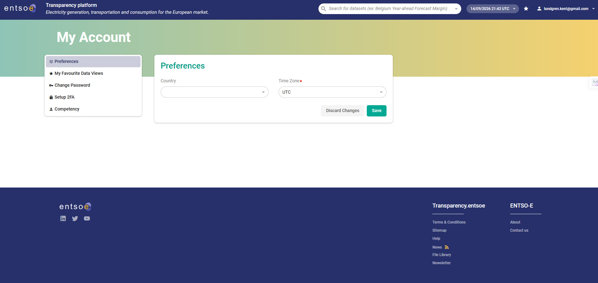
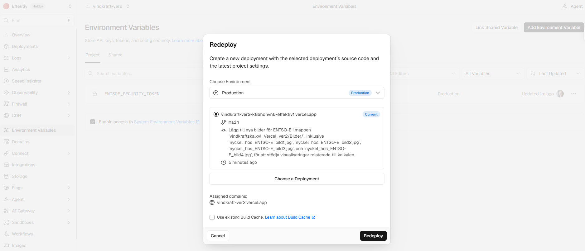

# Hur man skaffar nyckel hos ENTSO-E

Den här filen är steg-för-steg för knappen **Hämta aktuellt spotpris** i
[vindkraftskalkyl_Vercel_ver2](https://vindkraft-ver2.vercel.app).
Utan en personlig API-nyckel från ENTSO-E Transparency Platform svarar Vercel
med att `ENTSOE_SECURITY_TOKEN` saknas. Kalkylen räknar ändå, med manuellt pris.

**Kort läge just nu (14–15 september 2026):** mejlet och supportärendet är rätt
gjorda. Själva nyckeln kan **inte** skapas än – det är nästa steg *efter*
ENTSO-E:s bekräftelse, ofta inom tre arbetsdagar. Redeploy i Vercel är sista
steget, inte nästa.

Vad nyckeln *är* i Vercel-sammanhang: [Environment variables](Vercel-teknik-ver2.md#Environment-variables).
Varför knappen behöver en Function: [Vercel Functions](Vercel-teknik-ver2.md#Vercel-Functions).
Elpriskälla och omräkning till kr/kWh: [README – Elpriskälla](README.md#Elpriskalla).

## 🗂️ Lokalt repo

Repo-rot lokalt:

`C:\Users\kentl\OneDrive\AI\Cursor\Intressen\Vindkraft`

Den här filen lokalt:

`C:\Users\kentl\OneDrive\AI\Cursor\Intressen\Vindkraft\vindkraftskalkyl_Vercel_ver2\Hur-skaffa-nyckel-hos-ENTSO-E.md`

På GitHub: <https://github.com/kentlundgren/Vindkraft/blob/main/vindkraftskalkyl_Vercel_ver2/Hur-skaffa-nyckel-hos-ENTSO-E.md>

Skärmbilderna ligger i [`Bilder/`](Bilder/).

---

## Vad ENTSO-E är [#](#Vad-ENTSO-E-ar)

**ENTSO-E** är *European Network of Transmission System Operators for Electricity* –
det europeiska samarbetsorganet för **stamnätsföretag** (TSO:er) på el. Det är
en internationell ideell förening (AISBL) som samlar 40 medlems-TSO:er i
36 länder och samordnar drift, nätutveckling och marknadsfrågor i Europas
sammanhängande elsystem
([ENTSO-E, 2026a](https://www.entsoe.eu/about/inside-entsoe/objectives/)).

Sveriges medlem är **Svenska kraftnät**, med sedan starten
([ENTSO-E, 2026b](https://www.entsoe.eu/about/inside-entsoe/members/);
[Svenska kraftnät, 2023](https://www.svk.se/en/national-grid/international-cooperation/)).

### Hur organisationen bildades

Långt innan ENTSO-E fanns regionala samarbeten mellan stamnätsföretag
(bland annat UCTE på kontinenten och NORDEL i Norden). EU:s **tredje
energipaket** 2009 gav det europeiska TSO-samarbetet ett rättsligt uppdrag.
ENTSO-E bildades som förening i Bryssel i december 2008 och blev operativt
1 juli 2009 ([Svenska kraftnät, 2023](https://www.svk.se/en/national-grid/international-cooperation/);
[ENTSO-E, 2024](https://www.entsoe.eu/news/2024/12/04/entso-e-celebrates-its-role-in-advancing-europe-s-energy-transition/)).

Uppdraget är dubbelt: hålla dagens system säkert och effektivt, och förbereda
ett elsystem som klarar klimatneutralitet
([ENTSO-E, 2026a](https://www.entsoe.eu/about/inside-entsoe/objectives/)).

### Fysisk hemvist

Sekretariatet och det registrerade sätet ligger i **Bryssel**,
**Rue de Spa 8, 1000 Brussels, Belgium**
([ENTSO-E, 2026c](https://www.entsoe.eu/contact/)).

### Hur organisationen har utvecklats

Från tekniskt driftsamarbete har ENTSO-E fått fler lagstyrda uppgifter:
nätkoder, den tioåriga nätutvecklingsplanen (TYNDP), kapacitets- och
tillräcklighetsanalyser, gemensamma balanseringsplattformar – och **öppen
publicering av marknadsdata**
([Svenska kraftnät, 2023](https://www.svk.se/en/national-grid/international-cooperation/)).
Ukrainas Ukrenergo blev medlem 1 januari 2024
([ENTSO-E, 2026b](https://www.entsoe.eu/about/inside-entsoe/members/)).

**Transparency Platform** (https://transparency.entsoe.eu/) är den centrala
webbplatsen för den datan. Den lanserades 5 januari 2015 enligt
[förordning (EU) nr 543/2013](https://eur-lex.europa.eu/eli/reg/2013/543/oj)
om inlämning och offentliggörande av uppgifter på elmarknaderna
([ENTSO-E, 2026d](https://www.entsoe.eu/data/transparency-platform/);
Europeiska kommissionen, 2013). Stamnätsföretag, elbörser och andra
dataleverantörer skickar in; ENTSO-E publicerar. I Sverige tillsynar
Energimarknadsinspektionen, och Svenska kraftnät är TSO som bearbetar och
vidarebefordrar flera uppgifter
([Svenska kraftnät, 2025](https://www.svk.se/om-kraftsystemet/legalt-ramverk/eu-lagstiftning-/transparensforordningen/)).

### Vilka som har nytta av tjänsterna

| Aktör | Typisk nytta |
|-------|----------------|
| **Stamnätsföretag** (t.ex. Svenska kraftnät) | Samordnad drift, nätplaner, gemensamma regler; rapporterar data till plattformen. |
| **Elbörser och handelsaktörer** | Samma synliga grunddata (produktion, last, överföring, avbrott, priser) så att ingen sitter med ett informationsövertag. |
| **Tillsynsmyndigheter** (Ei, ACER) | Kontroll av transparensförordningen och välfungerande marknader. |
| **Producenter, balansansvariga, handlare** | Underlag för produktions- och handelsbeslut. |
| **Forskare, journalister, allmänhet** | Öppen tillgång via webben; maskinläsning via REST API (kräver den nyckel den här filen handlar om). |
| **Den här kalkylen** | Dygnssnitt av dagen-före-pris för SE1–SE4, utan att nyckeln läggs i webbläsarens JavaScript. |

Marknadsplatsen för nordiska spotpriser är **Nord Pool**. ENTSO-E är inte
börsen – de **återpublicerar** officiella dagen-före-priser (dokumenttyp A44)
så att de går att hämta programmässigt. Nord Pools eget API är betalt och
används inte här. Se [README – Elpriskälla](README.md#Elpriskalla).

---

## Hur man skaffar nyckeln [#](#Hur-skaffa-nyckel-hos-ENTSO-E)

`ENTSOE_SECURITY_TOKEN` är **din personliga API-nyckel** till Transparency
Platform. Den är gratis. Den ska ligga i Vercel, aldrig i Git och aldrig i en
chatt. Officiell guide:
[How to get security token?](https://transparencyplatform.zendesk.com/hc/en-us/articles/12845911031188-How-to-get-security-token)
([ENTSO-E Transparency Platform Helpdesk, 2026](https://transparencyplatform.zendesk.com/hc/en-us/articles/12845911031188-How-to-get-security-token)).

### 1. Konto på Transparency Platform

Gå till [https://transparency.entsoe.eu/](https://transparency.entsoe.eu/),
**Sign In** → **Register**, och bekräfta mejlet. När du är inloggad ser du
kartan med elområden (bidding zones), bland annat SE1–SE4.

Samma bild på GitHub: [nyckel_hos_ENTSO-E_bild1.jpg](https://github.com/kentlundgren/Vindkraft/blob/main/vindkraftskalkyl_Vercel_ver2/Bilder/nyckel_hos_ENTSO-E_bild1.jpg)

Ett konto räcker **inte** för REST API. Det är nästa steg.

### 2. Mejla och be om RESTful API access

Till: `transparency@entsoe.eu`
Ämne: `RESTful API access`
I mejlet: **samma e-postadress som kontot** registrerades med.

Samma bild på GitHub: [nyckel_hos_ENTSO-E_bild2.jpg](https://github.com/kentlundgren/Vindkraft/blob/main/vindkraftskalkyl_Vercel_ver2/Bilder/nyckel_hos_ENTSO-E_bild2.jpg)

### 3. Vänta på att ärendet tas emot – och på bekräftelse

Du får först ett kvitto på att supporten mottagit ärendet. Det är **inte**
samma sak som att API-åtkomst är beviljad. Beviljandet kommer i ett senare
mejl, enligt helpdesken ofta inom **tre arbetsdagar**.

Samma bild på GitHub: [nyckel_hos_ENTSO-E_bild3.jpg](https://github.com/kentlundgren/Vindkraft/blob/main/vindkraftskalkyl_Vercel_ver2/Bilder/nyckel_hos_ENTSO-E_bild3.jpg)

Tills dess: skriv in elpriset manuellt i kalkylen. Aktuellt spot utan API finns
på [Nord Pools dataportal](https://data.nordpoolgroup.com/auction/day-ahead/prices).

### 4. Skapa security token (först efter bekräftelsen)

Logga in → **My Account** → **Generate a (new) token**.

Innan åtkomst är beviljad ser My Account bara vanliga kontoinställningar
(Preferences, lösenord, 2FA). **Det finns då ingen token-knapp** – det är
förväntat, inte ett fel.

Samma bild på GitHub: [nyckel_hos_ENTSO-E_bild4.jpg](https://github.com/kentlundgren/Vindkraft/blob/main/vindkraftskalkyl_Vercel_ver2/Bilder/nyckel_hos_ENTSO-E_bild4.jpg)

När knappen väl finns: kopiera nyckeln och spara den tillfälligt hos dig.
Klistra **inte** in den i den här filen, i Git eller i en AI-chatt.

### 5. Lägg nyckeln i Vercel och gör en ny deploy

1. Öppna [vindkraft-ver2](https://vercel.com/effektiv1/vindkraft-ver2) → **Environment Variables**.
2. Variabelnamn exakt: `ENTSOE_SECURITY_TOKEN`.
3. Värde: den riktiga nyckeln från steg 4.
4. Kryssa i Production, Preview och Development.
5. **Redeploy** av production – en redan gjord deploy läser inte in en ny
   variabel ([Vercel, 2026g](https://vercel.com/docs/environment-variables)).

Samma bild på GitHub: [nyckel_hos_ENTSO-E_bild5.jpg](https://github.com/kentlundgren/Vindkraft/blob/main/vindkraftskalkyl_Vercel_ver2/Bilder/nyckel_hos_ENTSO-E_bild5.jpg)

Hur dashboarden ser ut i övrigt: [Hur man arbetar med Vercel](Vercel-teknik-ver2.md#Hur-man-arbetar-med-Vercel).

### 6. Testa knappen

Ladda om [https://vindkraft-ver2.vercel.app](https://vindkraft-ver2.vercel.app),
välj elområde, klicka **Hämta aktuellt spotpris**.

Lyckas det fylls **Spotpris hushållsel** (inte *Intäkt för elen*, om inte
rutan *Använd också som intäkt för elen* är ikryssad). Statusraden visar
datum, kr/kWh och EUR/MWh.

---

## Har stegen gjorts rätt? [#](#Har-stegen-gjorts-ratt)

Ja på det som *kan* göras nu. Nej, nyckeln är inte färdig – och det syns på
bilderna.

| Steg | Bild | Bedömning |
|------|------|-----------|
| Konto och inloggning | bild 1 | Rätt. Inloggad på produktionssajten, kartan med SE1–SE4 syns. |
| Mejlet | bild 2 | Rätt. Mottagare, ämne och registrerad e-post i kroppen följer helpdesken. |
| Kvitto | bild 3 | Rätt. Supporten har tagit emot ärendet. Det är kö – inte godkännande. |
| Skapa token | bild 4 | Förväntat. My Account visar bara Preferences. Token-knappen kommer efter bekräftelsemejlet. Tomt land och tidszon UTC påverkar inte API-ansökan. |
| Vercel | bild 5 | Rätt *plats* och rätt *variabelnamn*. Redeploy är rätt *sista* steg. Gör det när värdet är den riktiga nyckeln från steg 4. En tom eller påhittad nyckel ger antingen samma fel som förut, eller “ENTSO-E avvisade nyckeln”. |

**Nästa handling:** vänta på mejl från ENTSO-E → My Account → Generate token →
klistra in i den befintliga Vercel-variabeln → Redeploy → testa knappen.

---

## Kan man få genomsnittspriser för dygn, vecka, månad och år? [#](#Genomsnittliga-elpriser)

**Ja, underlaget finns – men ENTSO-E publicerar tidsserien, inte en färdig
“månadsmedel-knapp” för A44.** Dagen-före-priserna kommer som många punkter
per dygn (timme eller kvart, beroende på marknadens upplösning). Ett
medelvärde för en längre period räknar man genom att ta medel av de punkterna.

| Period | På Transparency Platform / REST API | I den här kalkylen nu |
|--------|--------------------------------------|------------------------|
| **Ett dygn** | Ja. Begär `periodStart`–`periodEnd` för 24 timmar och medelvärdesbilda. | **Ja.** `/api/elpris` tar ett helt leveransdygn och räknar medel, omräknat till kr/kWh via Riksbanken. |
| **En vecka** | Ja, genom att hämta sju dygn (eller ett längre intervall) och medelvärdesbilda. | Nej. Inte byggt. |
| **En månad** | Ja, samma princip. | Nej. |
| **Ett år** | Ja, samma princip. Många punkter; håll koll på API-gränsen (helpdesken anger 400 anrop per minut och nyckel). | Nej. |

På **webben** (utan egen kod) kan du titta på dagen-före-priser per elområde
och välja tidsintervall i gränssnittet:
[https://transparency.entsoe.eu/](https://transparency.entsoe.eu/).
Nord Pools [dataportal](https://data.nordpoolgroup.com/auction/day-ahead/prices)
visar samma marknad mer “börslikt”.

Kalkylens Function hämtar medvetet **ett** dygn (idag, annars igår, annars
imorgon) – inte tre dygns medel – eftersom ett dygnssnitt redan är en
ögonblicksbild, inte ett 25-årsantagande för *Intäkt för elen*. Se
`api/elpris.js` och [Vad ver2 gör](Vercel-teknik-ver2.md#Vad-ver2-gor).

Vecko-, månads- eller årsmedel i knappen vore en **ny funktion**, inte något
som “följer med” när nyckeln är på plats. Säg till om det ska byggas.

---

## Källor

ENTSO-E (2024) *ENTSO-E Celebrates its role in Advancing Europe’s Energy Transition.* Tillgänglig: https://www.entsoe.eu/news/2024/12/04/entso-e-celebrates-its-role-in-advancing-europe-s-energy-transition/ (hämtad 15 september 2026). *(Femtonårsmarkering: 40 TSO:er i 36 länder, samordning av Europas sammankopplade elnät.)*

ENTSO-E (2026a) *ENTSO-E Mission Statement.* Tillgänglig: https://www.entsoe.eu/about/inside-entsoe/objectives/ (hämtad 15 september 2026). *(Vad föreningen är och det dubbla uppdraget: drift idag och klimatneutralt system.)*

ENTSO-E (2026b) *Member Companies.* Tillgänglig: https://www.entsoe.eu/about/inside-entsoe/members/ (hämtad 15 september 2026). *(Medlemslista; Sverige = Svenska kraftnät. Ukrenergo medlem från 1 januari 2024.)*

ENTSO-E (2026c) *Contact ENTSO-E.* Tillgänglig: https://www.entsoe.eu/contact/ (hämtad 15 september 2026). *(Registrerat säte: Rue de Spa 8, 1000 Brussels.)*

ENTSO-E (2026d) *Electricity Market Transparency.* Tillgänglig: https://www.entsoe.eu/data/transparency-platform/ (hämtad 15 september 2026). *(Transparency Platform lanserad 5 januari 2015 enligt förordning 543/2013; data från TSO:er, elbörser och andra.)*

ENTSO-E Transparency Platform Helpdesk (2026) *How to get security token?* Tillgänglig: https://transparencyplatform.zendesk.com/hc/en-us/articles/12845911031188-How-to-get-security-token (hämtad 15 september 2026). *(Officiella stegen: registrera, mejla RESTful API access, vänta upp till tre arbetsdagar, generera token.)*

Europeiska kommissionen (2013) *Kommissionens förordning (EU) nr 543/2013 av den 14 juni 2013 om inlämning och offentliggörande av uppgifter på elmarknaderna.* EUT L 163, 15.6.2013. Tillgänglig: https://eur-lex.europa.eu/eli/reg/2013/543/oj (hämtad 15 september 2026). *(Rättslig grund för den centrala transparensplattformen som ENTSO-E ska driva.)*

Svenska kraftnät (2023) *International cooperation.* Tillgänglig: https://www.svk.se/en/national-grid/international-cooperation/ (hämtad 15 september 2026; sidan angav granskad 4 oktober 2023). *(ENTSO-E bildat och givet mandat i tredje energipaketet 2009; Svenska kraftnät medlem sedan starten.)*

Svenska kraftnät (2025) *Transparensförordningen.* Tillgänglig: https://www.svk.se/om-kraftsystemet/legalt-ramverk/eu-lagstiftning-/transparensforordningen/ (hämtad 15 september 2026; sidan angav granskad 31 mars 2025). *(Plattformen är öppen för allmänheten; Ei tillsynar; Svenska kraftnät vidarebefordrar flera svenska uppgifter.)*

Vercel (2026g) *Environment Variables.* Tillgänglig: https://vercel.com/docs/environment-variables (hämtad 14 september 2026). *(Ny variabel gäller först vid ny deploy – därför Redeploy efter att token klistrats in.)*

---

*Skapad 2026-09-15. Skärmbilder från Kents ansökan om RESTful API access samma dygn.*
