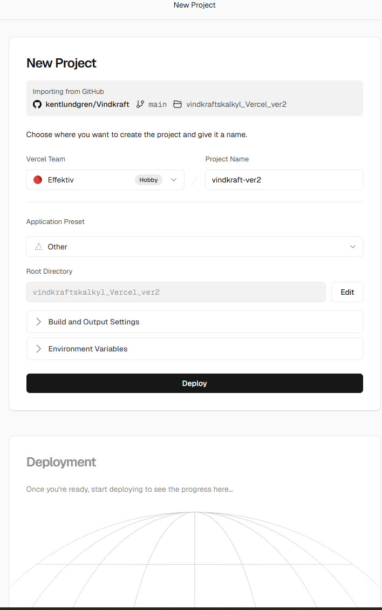
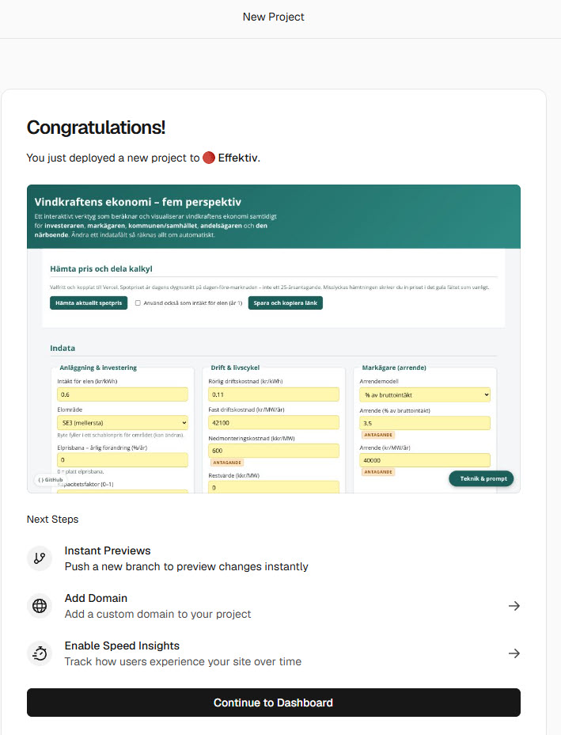
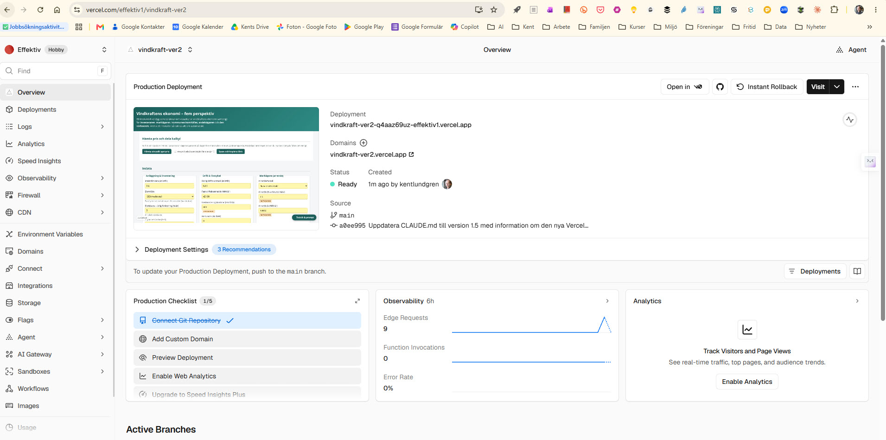
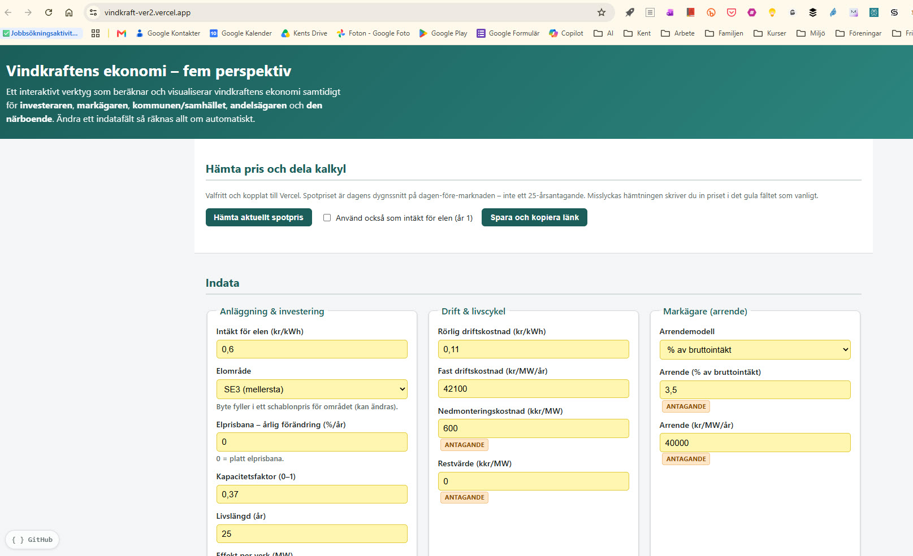

# Vercel-teknik – vad som är unikt med `vindkraftskalkyl_Vercel_ver2`

Den här filen förklarar **Vercel-teknik** för den kalkyl som är *byggd för plattformen*,
inte bara flyttad dit som statiska filer.

Live: [https://vindkraft-ver2.vercel.app](https://vindkraft-ver2.vercel.app)  
Vercel-projekt: **vindkraft-ver2** i teamet **Effektiv** (`effektiv1`)  
Dashboard: [https://vercel.com/effektiv1/vindkraft-ver2](https://vercel.com/effektiv1/vindkraft-ver2)

Programversionen (GitHub Pages, bara filer) ligger kvar:
[https://kentlundgren.github.io/Vindkraft/vindkraftskalkyl/vindkraftskalkyl.html](https://kentlundgren.github.io/Vindkraft/vindkraftskalkyl/vindkraftskalkyl.html)

Den statiska Vercel-tvillingen (samma tre filer, ingen Function) ligger kvar:
[https://vindkraft-rosy.vercel.app](https://vindkraft-rosy.vercel.app)

Skillnaden mot de två är inte färgerna eller LCOE-formlerna. Skillnaden är att
**vissa knappar får fråga en liten server** som Vercel driver, och att
**Git-push räcker för att publicera**. Det är det som är unikt med Vercel här.

Se också [README](README.md) för deploy-steg och elpriskälla, och
[Hur-skaffa-nyckel-hos-ENTSO-E.md](Hur-skaffa-nyckel-hos-ENTSO-E.md) för
ENTSO-E-nyckeln (konto, mejl, token i Vercel). Den äldre översikten (skriven
*innan* ver2 fanns) ligger i
[../vindkraftskalkyl_Vercel/Vercel-teknik.md](../vindkraftskalkyl_Vercel/Vercel-teknik.md).

## 🗂️ Lokalt repo

Repo-rot lokalt:

`C:\Users\kentl\OneDrive\AI\Cursor\Intressen\Vindkraft`

Den här filen lokalt:

`C:\Users\kentl\OneDrive\AI\Cursor\Intressen\Vindkraft\vindkraftskalkyl_Vercel_ver2\Vercel-teknik-ver2.md`

På GitHub: <https://github.com/kentlundgren/Vindkraft/blob/main/vindkraftskalkyl_Vercel_ver2/Vercel-teknik-ver2.md>

---

<a id="Vad-statisk-kod-inte-kan"></a>

## Vad “normal” HTML, CSS och JS *inte* kan [#](#Vad-statisk-kod-inte-kan)

I [programversionen](https://kentlundgren.github.io/Vindkraft/vindkraftskalkyl/vindkraftskalkyl.html)
händer tre saker:

1. Webbläsaren hämtar HTML, CSS och JavaScript.
2. Användaren skriver indata i gula fält.
3. JavaScript räknar och ritar resultatet **på användarens dator**.

Det räcker för LCOE, payback, NPV, IRR och de fem perspektiven. Det räcker **inte**,
utan att läcka hemligheter eller lita på någon annans server, att:

- Gömma en API-nyckel (allt i `berakningar.js` kan läsas med “visa källa”).
- Hämta data från en källa som **blockerar anrop från webbläsaren** (CORS), eller som kräver en hemlig nyckel.
- Spara ett scenario så att *en annan person på en annan dator* kan öppna samma läge, utöver att klistra allt i URL:en.
- Köra kod på en tidpunkt (“varje morgon, hämta elpris”) oberoende av om någon har sidan öppen.

GitHub Pages är **bara filer**. Ingen egen backend. Den statiska Vercel-appen
(`vindkraft-rosy`) är samma sak: Vercel används där som *host*, inte som *teknik i kalkylen*.

**Unikt med Vercel i ver2:** hosten kan också köra kod när någon anropar `/api/...`.
Då slutar Vercel att bara vara en annan adress.

---

<a id="Vercel-Functions"></a>

## Vercel Functions – “en liten server” [#](#Vercel-Functions)

En **Vercel Function** är serverkod som Vercel kör **när någon anropar den** –
till exempel när kalkylen ber om `/api/elpris`. Ingen virtuell maskin att sköta,
ingen server som står på dygnet. Vercel startar funktionen vid behov och stänger
ner den när det är tyst ([Vercel, 2026f](https://vercel.com/docs/functions)).

Det är den egentliga skillnaden mot GitHub Pages.

```
Webbläsare (kalkylen)  →  GET /api/elpris?omrade=SE4  →  Vercel Function
                                                      →  hämtar ENTSO-E med nyckel från Vercel
                                                      →  räknar om EUR/MWh → kr/kWh (Riksbanken)
                                                      →  skickar tillbaka tal + källa + datum
```

I den här mappen ligger funktionerna som vanliga filer:

| Fil | Adress på live-appen |
|-----|----------------------|
| `api/elpris.js` | https://vindkraft-ver2.vercel.app/api/elpris?omrade=SE4 |
| `api/scenario.js` | https://vindkraft-ver2.vercel.app/api/scenario |

**Vad det gör i kalkylen**

- Knappen **Hämta aktuellt spotpris** fyller fältet via `/api/elpris`. Nyckeln
  `ENTSOE_SECURITY_TOKEN` ligger i Vercel, inte i JavaScript-filen.
- Knappen **Spara och kopiera länk** skickar indata till `/api/scenario`. Servern
  validerar fälten och ger tillbaka en delningskod.

**Vad det *inte* är:** en ersättning för LCOE/NPV-räkningen. Den ligger kvar i
webbläsaren, så kalkylen är snabb även om API:t strular. Misslyckas hämtningen
visas ett fel i röd text; de gula fälten går att använda som vanligt.

---

<a id="Tunn-API-yta"></a>

## Tunn API-yta (`/api/...`) [#](#Tunn-API-yta)

“Tunn API-yta” är inte en separat Vercel-produkt. Det är ett **sätt att organisera**
Functions: få, tydliga adresser.

Det som *finns* i ver2:

| Adress | Gör | Kan statisk HTML/JS göra det ensam? |
|--------|-----|--------------------------------------|
| `GET /api/elpris` | Dygnssnitt för dagen-före-pris + källa | Nej, inte säkert mot ENTSO-E (nyckel) |
| `POST /api/scenario` | Validerar och packar ett indata-set | Bara delvis (localStorage / lång URL). Se [Dela kalkyl som länk](#Dela-kalkyl-som-lank). |
| `GET /api/scenario` | Läser tillbaka setet (`?id=` eller `?token=`) | Samma begränsning |

“Tunn” betyder: **två endpoints, en uppgift var**, ingen egen webbserver att driva.
Gränssnittet är fortfarande HTML, CSS och vanilla JavaScript. Ingen React.

PDF-export och inloggning finns **inte** i ver2. De skulle också kunna vara Functions,
men de är inte byggda.

---

<a id="Environment-variables"></a>

## Environment variables – hemligheter utanför koden [#](#Environment-variables)

På Vercel lagras nycklar i projektets **Environment Variables** (menyn till vänster
i dashboarden, se [bilden under arbetssätt](#Hur-man-arbetar-med-Vercel)). Functions
läser dem vid körning. De ska **inte** checkas in i Git
([Vercel, 2026g](https://vercel.com/docs/environment-variables)).

| Variabel | Behövs för | Obligatorisk? |
|----------|------------|----------------|
| `ENTSOE_SECURITY_TOKEN` | `/api/elpris` | Ja, om knappen ska hämta skarpt pris. Utan den svarar API:t med ett tydligt fel; kalkylen räknar ändå. Steg och skärmbilder: [Hur-skaffa-nyckel-hos-ENTSO-E.md](Hur-skaffa-nyckel-hos-ENTSO-E.md). |
| `UPSTASH_REDIS_REST_URL` + `UPSTASH_REDIS_REST_TOKEN` | korta koder `?s=abc123` | Nej. Utan Redis blir delningslänken längre (`?t=...`) men fungerar. |

På GitHub Pages finns inget motsvarande: allt webbläsaren behöver är synligt.

I dashboarden för **vindkraft-ver2** finns **Environment Variables** i vänstermenyn,
bredvid Storage, Logs och Domains. Dit hör token – inte till `berakningar.js`.

---

<a id="Annat-Vercel-kan"></a>

## Andra Vercel-delar som *är* unika – och vad ver2 använder [#](#Annat-Vercel-kan)

Det här är plattformens övriga byggklossar. Tabellen skiljer på **unikt för Vercel
jämfört med GitHub Pages** och **om ver2 använder det nu**.

| Teknik | Vad som är unikt | I ver2 nu? |
|--------|------------------|------------|
| **Git-integration + Root Directory** | Ett GitHub-repo kan ge *flera* appar, en mapp per projekt | Ja. Root Directory = `vindkraftskalkyl_Vercel_ver2` |
| **Automatisk deploy vid push** | Ingen FTP, inget extra publiceringssteg efter första kopplingen | Ja, mot branchen `main` |
| **Functions** | Serverkod utan egen server | Ja, `api/elpris.js` och `api/scenario.js` |
| **Environment variables** | Hemligheter utanför klientkoden | Ja, när token är ifylld |
| **CDN** | Filerna serveras från noder nära användaren | Ja, automatiskt |
| **Dashboard** (Overview, Logs, Rollback, Visit) | Se status, loggar, backa en deploy | Ja. [vindkraft-ver2](https://vercel.com/effektiv1/vindkraft-ver2) |
| **Preview-URL per branch** | Testa utan att röra production | Möjligt; används när en annan branch pushas |
| **Cron Jobs** | Anropa en Function på schema | Nej, inte i ver2 |
| **Upstash Redis / Blob** | Kort kod som överlever mellan anrop | Valfritt, inte krav |
| **Auth** | Inloggning | Nej – överkurs |

Hobby-teamet Effektiv (`effektiv1`) räcker. ver2 är ett **nytt projekt i samma team**,
inte ett nytt team. Projektet `vindkraft` (rosy-URL:en) ligger kvar bredvid.

---

<a id="Vad-ver2-gor"></a>

## Vad `vindkraftskalkyl_Vercel_ver2` gör – konkret [#](#Vad-ver2-gor)

Jämfört med [programversionen](https://kentlundgren.github.io/Vindkraft/vindkraftskalkyl/vindkraftskalkyl.html):

**Fortsätter ske i webbläsaren**  
Indata, LCOE, payback, NPV, IRR, fem perspektiv, jämförelsetabell, gula fält.
Samma formler som i `vindkraftskalkyl/berakningar.js`.

**Sker via Vercel, och bara där**

1. **Hämta aktuellt spotpris** → `GET /api/elpris` (ENTSO-E + Riksbanken).
   Fyller *Spotpris hushållsel*. Kryssrutan “använd också som intäkt för elen”
   är av medvetet: ett dygnssnitt är inte ett 25-årsantagande.
2. **Spara och kopiera länk** → `POST /api/scenario`. Mottagaren öppnar samma
   indata via `?s=` (kort kod, om Redis) eller `?t=` (komprimerad länk).
   Hur det fungerar: [Dela kalkyl som länk](#Dela-kalkyl-som-lank).
3. Om API:t misslyckas: kalkylen fungerar med manuellt inskrivet pris.

Knappen *Hämta aktuellt spotpris* ligger högst upp. *Spara och kopiera länk*
ligger efter indata, vid nyckeltalen.

---

<a id="Dela-kalkyl-som-lank"></a>

## Dela kalkyl som länk – vad det är för teknik [#](#Dela-kalkyl-som-lank)

Det här är **inte** att servern sparar hela kalkylen som en fil. Det är en
**Vercel Function** som packar de gula indatafälten så att de får plats i
själva webbadressen.

Live-knappen: [https://vindkraft-ver2.vercel.app](https://vindkraft-ver2.vercel.app)
(efter indata, under nyckeltalen).

### Vad som händer när du klickar

1. Webbläsaren skickar **POST** `/api/scenario` med de gula fälten som JSON.
2. Functionen `api/scenario.js` släpper bara kända fält-id (se `lib/falt.js`)
   och avvisar extra data.
3. Fälten komprimeras med gzip och kodas till en textsträng (Base64).
   Därför börjar en lång länk ofta med `H4sI…` – det är gzip-huvudet.
4. Kalkylen kopierar `https://vindkraft-ver2.vercel.app/?t=…` till urklipp.
5. När någon öppnar länken gör sidan **GET** `/api/scenario?token=…`.
   Functionen packar upp strängen, fyller de gula fälten, och JavaScript
   **räknar om** LCOE, NPV och resten. Resultaten ligger alltså inte i länken.

Utan Redis (läget innan Storage kopplats) är det `?t=` – värdena *är* länken, därför blir den lång.
Med Upstash Redis ger Functionen en kort kod `?s=abc123` som pekar på samma paket i 30 dagar.

Vercels Redis-integration sätter ofta variablerna `KV_REST_API_URL` och `KV_REST_API_TOKEN`
(äldre namn från Vercel KV). Functionen läser dem, eller `UPSTASH_REDIS_REST_*` om de finns.
Getting started-sidan med `npm install @upstash/redis` behövs **inte** i den här kalkylen –
vi anropar Redis REST-API direkt.

### Varför det kallas Vercel-teknik

GitHub Pages kan bara servera filer. Där finns ingen `/api/scenario`.
På Vercel är `api/scenario.js` en liten server som startar när knappen anropas
och släcks när det är tyst – se [Vercel Functions](#Vercel-Functions).

Att *klistra indata i URL:en* går i princip även i ren JavaScript. Det Vercel
tillför här är att packningen och uppackningen sker **på servern**, med
validering, och att samma Function senare kan byta den långa strängen mot en
kort kod om Redis kopplas på.

Detaljer om den tunna API-ytan: [Tunn API-yta](#Tunn-API-yta).

---

<a id="Hur-man-arbetar-med-Vercel"></a>

## Hur man arbetar med Vercel [#](#Hur-man-arbetar-med-Vercel)

Två lägen. De ska inte blandas ihop.

| Läget | När | Vad som händer |
|-------|-----|----------------|
| **Första gången** | Ny app, nytt Vercel-projekt | De steg som står i [README – Deploy till effektiv1](README.md#Deploy-till-effektiv1). En gång per app. |
| **Därefter** | Varje ändring i Cursor | Kent committar och pushar. Vercel bygger om production. Inga åtta steg. |

Nedan är första gången för *just den här* appen, med skärmbilder från
14 september 2026. Kent skapade projektet i teamet Effektiv. Bilderna ligger i
[`Bilder/`](Bilder/).

### 1. Skapa projektet – team, namn, mapp

Vercel importerar GitHub-repot `kentlundgren/Vindkraft`, branchen `main`.
Det som gör att *den här* kalkylen deployas, och inte hela repot eller den
statiska tvillingen, är tre val:

- **Vercel Team:** Effektiv (Hobby) – samma team som `vindkraft`, inte ett nytt team.
- **Project Name:** `vindkraft-ver2`
- **Root Directory:** `vindkraftskalkyl_Vercel_ver2`
- **Application Preset:** Other (ingen Vite/React-build)

Environment Variables kan fällas ut redan här (token), eller fyllas i efteråt
under **Environment Variables** i dashboarden.



Samma bild på GitHub: [nytt_Vercel_projekt_vindkraftskalkyl_Vercel_ver2.jpg](https://github.com/kentlundgren/Vindkraft/blob/main/vindkraftskalkyl_Vercel_ver2/Bilder/nytt_Vercel_projekt_vindkraftskalkyl_Vercel_ver2.jpg)

**Det som är unikt här:** en mapp i ett befintligt GitHub-repo blir en egen app
med egen URL, utan att man skapar ett nytt Git-repo eller ett nytt Vercel-team.

### 2. Första deployen är klar

När **Deploy** är färdigt visar Vercel att projektet ligger i teamet Effektiv
och en förhandsvisning av kalkylen – inklusive raden *Hämta pris och dela kalkyl*,
som den statiska tvillingen saknar. **Next Steps** (Instant Previews, egen domän,
Speed Insights) är tillval, inte krav för att kalkylen ska fungera.



Samma bild på GitHub: [nytt_Vercel_projekt_vindkraftskalkyl_Vercel_ver2_bild2.jpg](https://github.com/kentlundgren/Vindkraft/blob/main/vindkraftskalkyl_Vercel_ver2/Bilder/nytt_Vercel_projekt_vindkraftskalkyl_Vercel_ver2_bild2.jpg)

### 3. Dashboarden – var man ser att Git och Vercel hänger ihop

Efter **Continue to Dashboard** är den löpande arbetsytan
[https://vercel.com/effektiv1/vindkraft-ver2](https://vercel.com/effektiv1/vindkraft-ver2).

På översikten syns bland annat:

- Teamet **Effektiv** uppe till vänster (Hobby).
- Projektnamnet **vindkraft-ver2**.
- Production-URL **vindkraft-ver2.vercel.app** och status **Ready**.
- Källa: Git-branchen `main`, commit gjord av `kentlundgren`.
- **Visit** – öppna live-sidan. **Instant Rollback** – backa till en tidigare deploy.
- Vänstermenyn: Deployments, Logs, Environment Variables, Storage, Domains.

**Observability** visar *Edge Requests* (sidan hämtas) och *Function invocations*
(någon anropar `/api/...`). Noll Function-anrop betyder att knapparna inte har
träffat servern ännu – eller att ingen har klickat “Hämta aktuellt spotpris”
sedan deployen. Det är inte samma sak som att kalkylen är trasig.



Samma bild på GitHub: [nytt_Vercel_projekt_vindkraftskalkyl_Vercel_ver2_bild3.jpg](https://github.com/kentlundgren/Vindkraft/blob/main/vindkraftskalkyl_Vercel_ver2/Bilder/nytt_Vercel_projekt_vindkraftskalkyl_Vercel_ver2_bild3.jpg)

**Det som är unikt här:** efter första kopplingen *är* publicering en Git-händelse.
Texten på översikten säger det rakt ut: *To update your Production Deployment, push to the main branch.*

### 4. Det användaren ser

Live-sidan är en vanlig webbadress:
[https://vindkraft-ver2.vercel.app](https://vindkraft-ver2.vercel.app)

Kalkylen ser ut som programversionen (gula fält, fem perspektiv), plus
Vercel-raden överst. GitHub-hörnan pekar på mappen
`vindkraftskalkyl_Vercel_ver2`. Teknik-modalen har en egen sektion för ver2;
originalprompten under den är oförändrad.



Samma bild på GitHub: [nytt_Vercel_projekt_vindkraftskalkyl_Vercel_ver2_bild4.jpg](https://github.com/kentlundgren/Vindkraft/blob/main/vindkraftskalkyl_Vercel_ver2/Bilder/nytt_Vercel_projekt_vindkraftskalkyl_Vercel_ver2_bild4.jpg)

**Vardagen efter det här:** redigera i Cursor → Kent committar och pushar →
Vercel deployar till samma URL. De åtta stegen i README körs inte om.

---

<a id="Prompten-i-Claude-Cursor-och-Grok"></a>

## Prompten i Claude, Cursor och Grok [#](#Prompten-i-Claude-Cursor-och-Grok)

Byggprompten som *skapade* ver2 ligger i den statiska Vercel-README:n
([#Forslag_pa_promt](https://github.com/kentlundgren/Vindkraft/tree/main/vindkraftskalkyl_Vercel#Forslag_pa_promt)).
Den är vanlig instruktionstext, inte låst till ett chattfönster.

När appen *redan är kopplad* till projektet `vindkraft-ver2` är arbetsflödet ett annat:

| Var du arbetar | Vad som händer med Vercel-tekniken |
|----------------|-------------------------------------|
| **Cursor** (vilken modell som helst) | Agenten kan ändra HTML/CSS/JS och `api/`-filer. Du committar och pushar. Vercel bygger om. Bäst passform. |
| **Claude Code** | Kan skriva filer om rätt mapp är öppen. Push bara om du ber om det. |
| **claude.ai / Grok på webben** | Kan föreslå kod att klistra in. Kan **inte** själva pusha eller se dashboarden. |

**Kort tumregel**

- Första gången en *ny* app: [deploy-stegen](README.md#Deploy-till-effektiv1) (en gång).
- Därefter: Cursor + Git. Vercel-tekniken (Functions, env, CDN) följer med automatiskt.
- Hemligheter hör hemma i Vercel Environment Variables, aldrig i en prompt och aldrig i Git.

Du behöver alltså **inte tre olika promptar** för att *förvalta* ver2. Du behöver
veta skillnaden mellan “skapa projektet” (bilderna ovan) och “ändra kalkylen” (push).

---

## Källor

Vercel (2026e) *Getting started with Vercel.* Tillgänglig: https://vercel.com/docs/getting-started-with-vercel/import (hämtad 14 september 2026). *(Hur ett GitHub-repo importeras som nytt projekt – det som bild 1 visar för vindkraft-ver2.)*

Vercel (2026f) *Vercel Functions.* Tillgänglig: https://vercel.com/docs/functions (hämtad 14 september 2026). *(Request-driven serverkod utan egen server – det GitHub Pages saknar, och det ver2 använder i `/api/`.)*

Vercel (2026g) *Environment Variables.* Tillgänglig: https://vercel.com/docs/environment-variables (hämtad 14 september 2026). *(Hemligheter som Functions kan läsa, men som inte ska ligga i klientens JavaScript.)*

---

*Skapad 2026-09-14. Projektet vindkraft-ver2 i teamet Effektiv, live https://vindkraft-ver2.vercel.app.*
